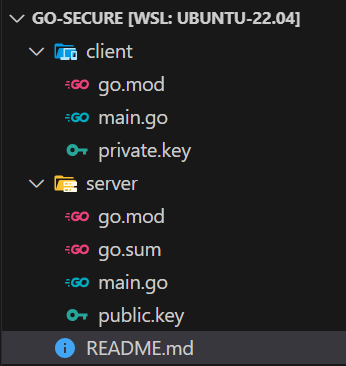

##  Public Key Authentication Patterns with Golang

### First, create a sample public and private key
```sh
$ cd client  && openssl genrsa 2048 > private.key
$ openssl rsa -pubout < private.key > public.key
```

public.key drag and drop into server folder 




### Server
- Server Setup and Request Handler Registration:
The program uses http.ListenAndServe to start an HTTP server on "localhost:8080".
It registers a handler function, handler, to process requests to the /authentication endpoint.

- HTTP Request Handling:
The program retrieves the digital signature from the Signature header of the request.
It reads the request body, which is the data subject to signature verification.

- Public Key Loading and Signature Verification:
The readPublicKey function reads the public key from a file.
The program then calls verifySignature, attempting to verify the digital signature of the request body using the public key.
If the signature is successfully verified, access is allowed; if not, it is denied.

- Response Sending:
Based on the outcome of the signature verification, the server sends an appropriate HTTP status code and message to the client.

```sh
$ go run main.go

# if get  req from client 
allow access !!!!
```

### Client 
- Private key reading: reads a private key file in PEM format using the readPrivateKey function. This function parses the private key in PKCS#8 format and returns it as crypto.

- Message preparation and signing: The Message structure is used to create the message to be sent and serialize it into JSON format. Then, use the signMessage function to sign the message with the RSA-SHA256 algorithm and generate the signature as a string in Base64 format.

- Sending HTTP request: The signed message is set to the body of the HTTP POST request and sent to the server using the sendRequest function. This function sets the content type and signature in the HTTP header and executes the request.

- Process response from server: Receives the response from the server, reads its content, and outputs it to the log.


```sh
$ go run main.go

# if post req for  server then sucess
2024/04/24 12:55:58 Response: "good job!"
```